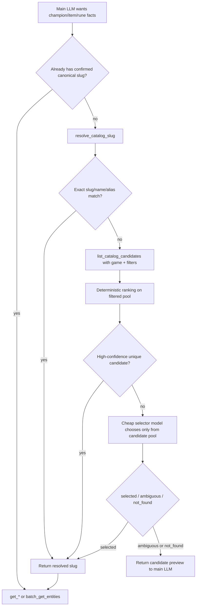
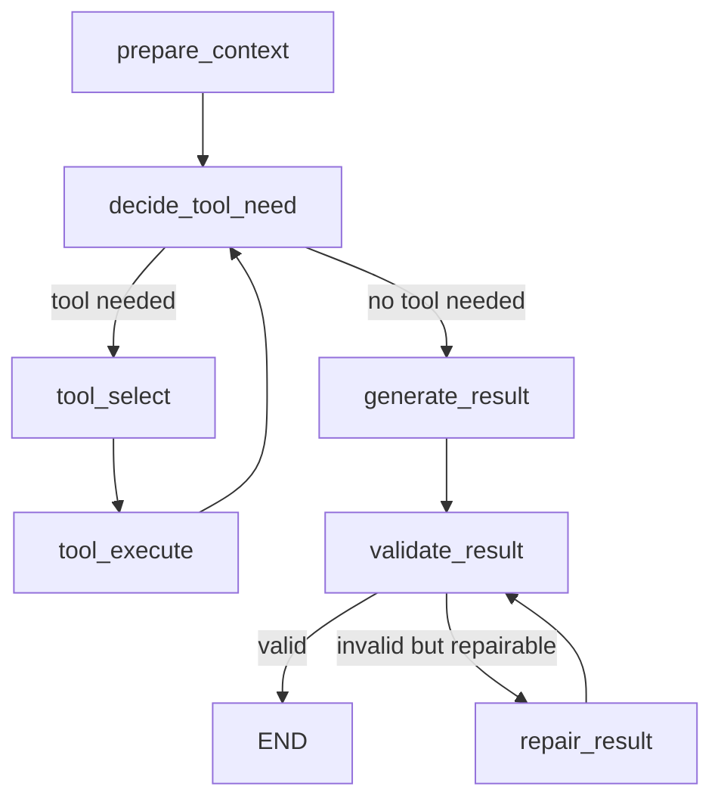

# PentaBuilder AI System Design

## 1. 目标

这份文档只做一件事：把 `PentaBuilder_BE` 的 AI 功能设计成可以直接实现的规格。

重点内容：

1. 在线 AI workflow 要有哪些。
2. 离线 workflow 要有哪些。
3. 每个 workflow 的输入、输出和执行图。
4. tool call 具体暴露哪些工具。
5. prompt 具体怎么拼。
6. 哪些地方用 `LangGraph`。

## 2. AI 功能列表

## 2.1 在线功能

在线 run type 固定为这 7 个：

1. `evaluate_build`
2. `recommend_full_build`
3. `recommend_slot`
4. `explain_slot`
5. `compare_builds`
6. `game_status`
7. `chat_followup`

## 2.2 离线功能

离线 workflow 固定为这 3 个：

1. `baseline_precompute`
2. `version_calibration`
3. `benchmark_run`

## 3. 在线 AI 的统一输入

所有在线功能都走同一个统一输入结构：

```json
{
  "run_type": "recommend_slot",
  "context": {
    "game": "lol",
    "data_version": "full-20260412",
    "own_champion_slug": "lol-ahri",
    "enemy_team": [
      {
        "champion_slug": "lol-zed",
        "build": [null, null, null, null, null, null],
        "runes": {
          "primary": [],
          "secondary": []
        }
      }
    ],
    "own_build": ["lol-luden-s-echo", null, null, null, null, null],
    "own_runes": {
      "primary": [],
      "secondary": []
    },
    "environment": {
      "tags": ["ranked", "assassin-heavy"],
      "free_text": ""
    }
  },
  "response_preferences": {
    "language": "zh-CN",
    "terminology_style": "slang_zh"
  },
  "payload": {
    "slot_index": 1
  }
}
```

## 4. 在线 AI 的统一预处理

在进入模型或 graph 前，后端先做固定预处理。

## 4.1 Canonicalization

必须做：

1. 从 `enemy_team` 提取 `enemy_champion_slugs_sorted`
2. `environment.tags` 排序去重
3. `own_build` 按游戏补齐：
   - LoL PC: 6 槽
   - Wild Rift: 7 槽
4. `own_runes` 和 `enemy_team[*].runes` 统一成稳定结构
5. 生成：
   - `semantic_context_hash`
   - `response_variant_hash`

说明：

- 外部 schema 里正式字段是 `enemy_team`
- 内部缓存和 leaderboard 计算时，后端再派生 `enemy_champion_slugs_sorted`
- 所有 champion/item/rune slug 统一使用带游戏前缀的 canonical 格式：
  - `lol-...`
  - `wr-...`
- 即使 slug 带前缀，`game` 仍然必须保留：
  - 方便前端明确展示当前工作区到底是 `LoL PC` 还是 `Wild Rift`
  - 方便后端校验 slug 与 game 是否一致

`environment.tags` 的 canonical 白名单固定为：

- `aram`
- `ranked`
- `normal`
- `tank-heavy`
- `assassin-heavy`
- `healing-heavy`
- `ap-heavy`
- `ad-heavy`
- `cc-heavy`
- `poke-heavy`
- `early-game`
- `late-game`

## 4.2 服务层直接注入的上下文

这些信息不交给模型自己查，直接由后端注入：

1. 我方英雄摘要
2. 敌方英雄摘要
3. 当前已填装备摘要
4. 当前已填符文摘要
5. baseline build/runes
6. calibration summary
7. 如果有 free text，则注入 reference cache summary
8. 如果属于聊天，则注入 session memory summary
9. 当前实体的本地化名称映射：
   - 至少包含 `zh-CN`
   - 若用户目标语言不是中文，也仍然保留中文映射，便于理解中文用户输入

## 4.3 注入给模型的 Context Bundle

进入 AI runtime 时，统一组装成：

```json
{
  "match_context": {},
  "context_bundle": {
    "own_champion": {},
    "enemy_champions": [],
    "selected_items": [],
    "selected_runes": []
  },
  "baseline": {},
  "calibration_summary": "string or null",
  "reference_cache_summary": "string or null",
  "session_memory_summary": "string or null",
  "localized_name_bundle": {}
}
```

## 5. Tool Call 设计

## 5.1 设计原则

tool call 只解决一个问题：

`当模型需要比较当前上下文之外的候选项时，按需拿少量结构化事实。`

tool 不做：

- 任意 SQL
- 任意文件读取
- 任意 bucket 读取
- 任意 session 历史读取

## 5.2 Tool 返回的数据格式

tool 不直接返回原始 JSON 文件，而是返回从真实数据字段里裁出来的 `ToolView`。

这里的设计以当前这三类文件为准：

- `game_data/wild_rift/champions.json`
- `game_data/wild_rift/items.json`
- `game_data/wild_rift/runes.json`

原则：

- 只保留对出装推荐有帮助的字段
- 不返回 `source`
- 不返回 `icon_url`
- 不返回大段 `notes`
- 不发明原始数据里没有的 `effect_tags / synergy_tags / damage_profile`
- 可按需附加来自 localization asset 的显示名映射，但 slug 始终保持 canonical 值

### ChampionToolView

从 `champions.json` 提取：

- `slug`
- `name`
- `infobox.Adaptive type`
- `infobox.Class(es)`
- `infobox.Position(s)`
- `infobox.Range type`
- `infobox.Resource`
- `abilities[*]` 的精简字段

格式：

```json
{
  "slug": "wr-aurora",
  "name": "Aurora",
  "adaptive_type": "Magic",
  "class_text": "Burst Assassin",
  "position_text": "Mid Baron Lane",
  "range_type": "Ranged",
  "resource": "Mana",
  "abilities": [
    {
      "skill": "1",
      "name": "Twofold Hex",
      "blurb": "Active: Aurora fires a bolt of energy that deals magic damage to enemies hit and marks them for a short time.",
      "damage_type": "magic",
      "affects": "Enemies",
      "targeting": "Direction / Auto",
      "range": null,
      "effect_radius": null,
      "leveling": "Magic Damage: to 4 (+ % AP)"
    }
  ]
}
```

说明：

- champion tool 保留 `abilities`，因为这是理解英雄出装方向最有价值的字段。
- `abilities[*].description` 和 `notes` 默认不返回，太长。
- `abilities[*].blurb` 比 `description` 更适合 prompt 注入。

### ItemToolView

从 `items.json` 提取：

- `slug`
- `name`
- `attributes.Cost`
- `attributes.Sell`
- `stats`
- `description`
- `similar_items`

格式：

```json
{
  "slug": "wr-abyssal-mask",
  "name": "Abyssal Mask",
  "cost": "3000",
  "sell": "2100",
  "stats": [
    "+10 ability haste",
    "+55 magic resistance",
    "+400 health"
  ],
  "description": null,
  "similar_item_names": [
    "Force of Nature"
  ]
}
```

说明：

- Wild Rift item 数据里 `description` 当前经常是 `null`，所以 AI 不能依赖这个字段。
- item tool 最重要的字段其实是 `cost + stats + similar_items`。
- `notes` 默认不返回，当前数据基本为空且价值不高。

### RuneToolView

从 `runes.json` 提取：

- `slug`
- `name`
- `path`
- `slot`
- `description`

格式：

```json
{
  "slug": "wr-adaptive-carapace",
  "name": "Adaptive Carapace",
  "path": "Resolve",
  "slot": "2",
  "description": "Passive: Gain 50 bonus health. Additionally while below 50% health, also gain 16 armor or 16 magic resistance..."
}
```

说明：

- rune 数据里最重要的信息几乎都在 `description`。
- `notes` 当前基本为空，不返回。

## 5.3 暴露给模型的工具

v1 改成只暴露 5 个更直接的工具。

### Tool 1: `get_champion`

用途：

- 精确读取一个英雄的 `ChampionToolView`

输入：

```json
{
  "game": "wild_rift",
  "data_version": "full-20260411",
  "slug": "wr-aurora"
}
```

输出：

```json
{
  "champion": {
    "slug": "wr-aurora",
    "name": "Aurora",
    "adaptive_type": "Magic",
    "class_text": "Burst Assassin",
    "position_text": "Mid Baron Lane",
    "range_type": "Ranged",
    "resource": "Mana",
    "abilities": [
      {
        "skill": "1",
        "name": "Twofold Hex",
        "blurb": "Active: Aurora fires a bolt of energy that deals magic damage to enemies hit and marks them for a short time.",
        "damage_type": "magic",
        "affects": "Enemies",
        "targeting": "Direction / Auto",
        "range": null,
        "effect_radius": null,
        "leveling": "Magic Damage: to 4 (+ % AP)"
      }
    ]
  }
}
```

### Tool 2: `get_item`

用途：

- 精确读取一个装备的 `ItemToolView`

输入：

```json
{
  "game": "wild_rift",
  "data_version": "full-20260411",
  "slug": "wr-abyssal-mask"
}
```

输出：

```json
{
  "item": {
    "slug": "wr-abyssal-mask",
    "name": "Abyssal Mask",
    "cost": "3000",
    "sell": "2100",
    "stats": [
      "+10 ability haste",
      "+55 magic resistance",
      "+400 health"
    ],
    "description": null,
    "similar_item_names": [
      "Force of Nature"
    ]
  }
}
```

### Tool 3: `get_rune`

用途：

- 精确读取一个符文的 `RuneToolView`

输入：

```json
{
  "game": "wild_rift",
  "data_version": "full-20260411",
  "slug": "wr-adaptive-carapace"
}
```

输出：

```json
{
  "rune": {
    "slug": "wr-adaptive-carapace",
    "name": "Adaptive Carapace",
    "path": "Resolve",
    "slot": "2",
    "description": "Passive: Gain 50 bonus health..."
  }
}
```

### Tool 4: `batch_get_entities`

用途：

- 一次批量读取多个同类型实体，减少工具轮次

输入：

```json
{
  "game": "wild_rift",
  "data_version": "full-20260411",
  "entity_type": "item",
  "slugs": [
    "wr-abyssal-mask",
    "wr-force-of-nature"
  ]
}
```

输出：

```json
{
  "entity_type": "item",
  "entities": [
    {
      "slug": "wr-abyssal-mask",
      "name": "Abyssal Mask",
      "cost": "3000",
      "sell": "2100",
      "stats": [
        "+10 ability haste",
        "+55 magic resistance",
        "+400 health"
      ],
      "description": null,
      "similar_item_names": [
        "Force of Nature"
      ]
    }
  ],
  "missing_slugs": []
}
```

限制：

- `slugs` 最多 12 个

### Tool 5: `search_catalog`

用途：

- 当模型不知道具体 slug 时，通过 `name / stats / description / blurb` 做模糊搜索

输入：

```json
{
  "game": "wild_rift",
  "data_version": "full-20260411",
  "entity_type": "item",
  "query": "magic resistance health item",
  "limit": 5
}
```

输出：

```json
{
  "entity_type": "item",
  "matches": [
    {
      "slug": "wr-abyssal-mask",
      "name": "Abyssal Mask",
      "cost": "3000",
      "stats": [
        "+10 ability haste",
        "+55 magic resistance",
        "+400 health"
      ],
      "matched_fields": [
        "stats",
        "name"
      ]
    },
    {
      "slug": "wr-force-of-nature",
      "name": "Force of Nature",
      "cost": "2900",
      "stats": [
        "+350 health",
        "+50 magic resistance"
      ],
      "matched_fields": [
        "stats",
        "name"
      ]
    }
  ]
}
```

限制：

- `limit <= 8`
- search 结果只返回轻量摘要，不返回完整能力/描述大块内容

### Tool 6: `list_catalog_candidates`

用途：

- 在主 LLM 已经知道 `game + entity_type + filter` 时，返回该过滤条件下的候选 slug 列表
- 典型场景包括：
  - `champion + lane`
  - `champion + class`
  - `item + category/subtype`
  - `rune + path/slot`

输入：

```json
{
  "game": "wild_rift",
  "entity_type": "champion",
  "filters": {
    "position": "mid"
  }
}
```

输出：

```json
{
  "game": "wild_rift",
  "entity_type": "champion",
  "applied_filters": {
    "position": "mid"
  },
  "candidate_count": 18,
  "candidates": [
    {
      "slug": "wr-ahri",
      "name": "九尾妖狐",
      "aliases": ["狐狸"],
      "class_text": "Burst",
      "position_tags": ["mid"]
    }
  ]
}
```

规则：

- 该工具必须带 `game`
- 该工具必须至少带一个有效 filter
- 返回的是 light candidate summaries，不是完整详情

### Tool 7: `resolve_catalog_slug`

用途：

- 当主 LLM 只有原始名字、别名、分路、类型提示时，把它解析成 canonical slug
- 这是一个内部 sub-workflow，不直接污染主生成节点的大上下文

内部步骤：

1. 先做 exact slug / exact name / alias match
2. 若未命中，则按主 LLM 提供的 filter 生成 candidate pool
3. 对 candidate pool 做 deterministic ranking
4. 若仍不够确定，则调用一个更便宜的 selector model，只允许它从候选集中选一个 slug
5. 若仍无法确定，则返回 `ambiguous` 或 `not_found`

输入：

```json
{
  "game": "wild_rift",
  "entity_type": "item",
  "raw_name": "queen crown",
  "filters": {
    "category": "ap"
  }
}
```

输出：

```json
{
  "game": "wild_rift",
  "entity_type": "item",
  "raw_name": "queen crown",
  "applied_filters": {
    "category": "ap"
  },
  "resolution_status": "resolved",
  "resolved_slug": "wr-crown-of-the-shattered-queen",
  "resolved_name": "Crown of the Shattered Queen",
  "resolved_by": "selector_model",
  "confidence": "medium",
  "selector_summary": "候选里只有这一项真正符合名字语义。",
  "candidate_count": 6,
  "candidates": [
    {
      "slug": "wr-crown-of-the-shattered-queen",
      "name": "Crown of the Shattered Queen",
      "aliases": []
    }
  ]
}
```

规则：

- 主 LLM 不应再手写未确认的 slug
- 如果 slug 未被注入、未被已有 tool 返回、也未被 `resolve_catalog_slug` 确认，就不能继续传给 `get_*` 或 `batch_get_entities`

## 5.4 不暴露给模型的内部加载器

这些只由服务层使用：

1. `load_baseline_build`
2. `load_calibration_summary`
3. `load_reference_cache_summary`
4. `load_session_memory_summary`
5. `load_context_entity_bundle`
6. `load_localization_bundle`

它们不作为 model-visible tools。

## 5.5 Tool 使用规则

每次 run 限制：

- 最大 tool rounds：`4`
- 最大总 tool calls：`8`
- 相同 tool + 相同参数不重复调用

不同 run type 的默认上限：

| run_type | 最大 tool rounds | 备注 |
|---|---:|---|
| `evaluate_build` | 2 | 通常只需补充比较项 |
| `recommend_full_build` | 4 | 允许先做 slug resolve，再做 candidate comparison |
| `recommend_slot` | 3 | 需要对比候选 item |
| `explain_slot` | 3 | 往往要比较当前项与替代项 |
| `compare_builds` | 3 | 可能需要查多个差异位 |
| `game_status` | 1 | 默认直接用注入的详细参数 appendix，不主动开工具 |
| `chat_followup` | 4 | 问题最开放 |

## 5.6 Slug Resolver 子流程



关键约束：

- `resolve_catalog_slug` 是 tool 内部 sub-workflow，不是最终回答节点
- selector model 只能从候选池里选，不能发明新 slug
- `list_catalog_candidates` 要求主 LLM 提前写好 filter
- 只有 resolved slug 才允许继续进入 `get_*` 或 `batch_get_entities`

## 6. LangGraph 设计

## 6.1 哪些地方使用 LangGraph

在线 6 个 run type 全部使用同一个 `OnlineRunGraph`。

原因：

- 输入结构统一
- 都可能需要 tool call
- 都需要结构化输出
- 都可以复用同一套状态机

离线功能里：

- `baseline_precompute` 复用 `OnlineRunGraph`
- `version_calibration` 不用 LangGraph，直接走批处理 pipeline
- `benchmark_run` 调用同一在线 graph

## 6.2 OnlineRunGraph 节点

统一节点固定为 7 个：

1. `prepare_context`
2. `decide_tool_need`
3. `tool_select`
4. `tool_execute`
5. `generate_result`
6. `validate_result`
7. `repair_result`

## 6.3 Graph 结构



## 6.4 每个节点做什么

### `prepare_context`

输入：

- `MatchContext`
- context bundle
- baseline
- calibration summary
- reference cache
- session memory

输出：

- 一个已经准备好的 prompt input block

这一节点不调用模型。

### `decide_tool_need`

规则优先，不必先上模型。

默认规则：

- `recommend_full_build`
  - 如果当前上下文只有 0-1 个敌方英雄且 baseline 足够，先尝试不调工具
- `recommend_slot`
  - 若目标槽位属于空槽位，且已知上下文不足以判断，则允许工具
- `explain_slot`
  - 默认允许工具
- `compare_builds`
  - 若差异位大于 2，默认允许工具
- `chat_followup`
  - 默认允许工具

输出：

```json
{
  "need_tools": true,
  "reason": "need_compare_candidate_items"
}
```

### `tool_select`

这里调用模型，但输出必须是结构化 tool call plan，而不是自由文本。

输出格式：

```json
{
  "tool_calls": [
    {
      "tool_name": "search_catalog",
      "arguments": {
        "game": "wild_rift",
        "data_version": "full-20260411",
        "entity_type": "item",
        "query": "defensive mage item against burst",
        "limit": 4
      }
    }
  ],
  "done": false
}
```

### `tool_execute`

作用：

- 执行 tool
- 记录 `tool_trace`
- 把结果写入 `tool_facts`
- 判断是否达到最大 tool 上限

### `generate_result`

这里调用模型输出目标 run type 的最终结构化结果。

输出要求：

- 严格 JSON
- 符合对应 run type schema
- 所有用户可见文本字段直接输出为 `response_preferences.language`
- prompt 中必须显式指定目标输出语言
- 即使目标输出语言不是中文，也要利用注入的中文名称映射来理解用户输入里出现的中文英雄/装备/符文名
- slug、数字、slot index 等结构化字段保持 canonical 值

### `validate_result`

先做程序校验，不用模型。

校验内容：

- JSON schema
- slug 是否存在
- score 是否在 0-100
- `recommend_slot` 是否改动了其他已填槽位
- `compare_builds.winner` 是否合法

### `repair_result`

只有在“结构接近正确但字段有错误”时才调用模型修复一次。

例如：

- build 长度不对
- alternatives 重复
- 缺少 winner

最多修复 `1` 次。

修复时仍必须保持原始目标语言，不应把文本改成别的语言。

## 6.5 Graph State

实现时 state 建议至少包含：

```python
class OnlineRunGraphState(TypedDict):
    run_type: str
    context: dict
    payload: dict
    response_preferences: dict

    injected_context: dict
    baseline: dict | None
    calibration_summary: str | None
    reference_cache_summary: str | None
    session_memory_summary: str | None

    tool_round_count: int
    total_tool_calls: int
    tool_trace: list[dict]
    tool_facts: dict

    model_result: dict | None
    validated_result: dict | None
    final_result: dict | None
    validation_errors: list[str]
```

## 7. Prompt 设计

## 7.1 Prompt 文件组织

建议目录：

```text
ai/prompts/
├── shared/
│   ├── system_base.md
│   ├── output_rules.md
│   ├── tool_rules.md
│   ├── generation_language_rules.md
│   └── localized_name_rules.md
├── evaluate_build.md
├── recommend_full_build.md
├── recommend_slot.md
├── explain_slot.md
├── compare_builds.md
├── game_status.md
└── chat_followup.md
```

## 7.2 Shared System Prompt

所有在线 run 共享同一个 system base。

建议内容直接写成下面这样：

```text
You are PentaBuilder AI, a League of Legends and Wild Rift build assistant.

Your job is to evaluate builds, recommend items/runes, explain item choices, compare builds, and answer follow-up questions.

Always use the provided game data and context first.
The current game will always be explicit in the injected context. Never mix League of Legends and Wild Rift entities.
All champion, item, and rune slugs use canonical prefixes: `lol-` or `wr-`.
Use tools only when you need additional facts that are not already injected.
Do not invent items, runes, champions, or effects.
Do not change filled slots unless the task explicitly allows it.
Return valid JSON that matches the required schema.
Generate the final result directly in the requested response language.
```

## 7.3 Shared Tool Rules Prompt

```text
Tool rules:
1. Only call tools when injected context is not enough.
2. Prefer batch tools over repeated single-item lookups.
3. Do not call the same tool with the same arguments more than once.
4. Stop using tools once you have enough information to answer.
5. You may suggest alternatives, but keep the final answer focused on the best choice.
```

## 7.4 Shared Output Rules Prompt

```text
Output rules:
1. Return only valid JSON.
2. Use slugs for item/rune/champion identifiers, and keep the `lol-` / `wr-` prefix intact.
3. All explanations should be concise and specific to the current context.
4. If information is insufficient, say so inside the explanation field instead of breaking schema.
5. Keep all natural-language output in the requested response language.
```

## 7.5 Shared Generation Language Rules Prompt

运行时插入：

```text
Generation language rules:
- Target language: {language}
- Terminology style: {terminology_style}
- Generate all user-facing text directly in the target language.
- When naming champions, items, or runes in prose, use the target-language display name if available.
- Keep slugs unchanged, including the `lol-` / `wr-` prefix.
```

## 7.6 Shared Localized Name Rules Prompt

```text
Localized name rules:
1. Users may mention champions, items, or runes in Chinese even when the target output language is not Chinese.
2. Use the injected localization bundle or tool-provided localized names to map those mentions to canonical slugs.
3. Keep slugs unchanged.
4. If a localized display name is unavailable in the target language, fall back to the English display name.
5. If the target language is zh-CN and terminology_style is slang_zh, prefer common player nicknames naturally.
```

## 7.7 各 run type 的具体 Prompt

下面不是建议，而是直接建议实现成模板。

### A. `evaluate_build`

模板内容：

```text
Task: Evaluate the current build and rune setup for this match context.

You must:
1. Give a score from 0 to 100.
2. Explain the main strengths.
3. Explain the main weaknesses.
4. Suggest a better build/rune direction if needed.

Do not rewrite the entire build unless the current build is clearly weak.
Focus on whether the current setup helps win under this context.
```

### B. `recommend_full_build`

模板内容：

```text
Task: Produce the single best ordered build path and rune setup for this match context.

You must:
1. Produce one best ordered build path.
2. Produce one best rune setup.
3. Respect already filled slots.
4. Explain the overall logic briefly.

Important constraints:
- `recommended_build_order` is a purchase sequence, not a static final inventory snapshot.
- For LoL PC, return exactly 6 item steps.
- For Wild Rift, return exactly 7 steps.
- In Wild Rift, the 7 steps must contain exactly 5 normal items, 1 boots step, and 1 separate enchant step.
- In Wild Rift, the boots step must come before the enchant step.
- If multiple options are viable, choose the single best one.
```

### C. `recommend_slot`

模板内容：

```text
Task: Recommend the best item for the requested slot.

You must:
1. Recommend exactly one best item for slot {slot_index}.
2. Treat all other filled slots as fixed constraints.
3. Do not change any other filled slot.
4. Explain why this item is best now.
5. Optionally mention 1-2 alternatives.
```

### D. `explain_slot`

模板内容：

```text
Task: Explain the current choice for slot {slot_index}.

You must:
1. Judge whether the current item is good or not under this context.
2. If it is not the best choice, name the best item.
3. Explain why the current choice works or fails.
4. Explain why the best choice is better.
5. You may mention linked earlier-slot adjustments if they materially matter.
```

### E. `compare_builds`

模板内容：

```text
Task: Compare build A and build B under the same match context.

You must:
1. Choose the better build.
2. Explain the main differences.
3. Explain which items/runes create that difference.
4. If build B can be better in a different situation, state that briefly.
```

### F. `chat_followup`

模板内容：

```text
Task: Answer the user's follow-up question inside the current session.

You must:
1. Answer the exact question directly.
2. Stay grounded in the current match context and recent session memory.
3. If needed, compare the current recommended choice against a user-mentioned alternative.
4. Keep the answer conversational but still structured.
```

## 7.8 Localized Name Asset

为了支持“中文输入 + 任意目标输出语言”的组合，建议单独维护一份 localization asset。

建议路径：

```text
game_localization/
├── lol/
│   ├── champions.zh-CN.json
│   ├── items.zh-CN.json
│   ├── runes.zh-CN.json
│   └── optional.<language>.json
└── wild_rift/
    ├── champions.zh-CN.json
    ├── items.zh-CN.json
    ├── runes.zh-CN.json
    └── optional.<language>.json
```

每个条目至少包含：

- `slug`
- `en_name`
- `zh_official_name`
- `zh_aliases[]`

可选扩展：

- `localized_display_names.{language}`

这份资产可以来自本地目录镜像，也可以来自 S3 / Blob Storage 挂载路径。

## 7.9 Prompt 最终拼装顺序

每次在线 run 最终 prompt 按这个顺序拼：

1. `system_base.md`
2. `tool_rules.md`
3. `output_rules.md`
4. `generation_language_rules.md`
5. `localized_name_rules.md`
6. run-specific prompt
7. context block
8. detailed parameter appendix（仅 `game_status`）
9. operation block
10. baseline block
11. calibration block
12. reference cache block
13. session memory block

## 8. 各 run type 的结构化输出

## 8.1 `evaluate_build`

```json
{
  "score": 84,
  "summary": "整体思路正确，但中期容错不足。",
  "strengths": [
    "爆发能力足够",
    "当前符文与英雄连招节奏匹配"
  ],
  "weaknesses": [
    "面对高爆发刺客时容错不足"
  ],
  "recommended_build": ["...", "...", null, null, null, null],
  "recommended_runes": {
    "primary": [],
    "secondary": []
  }
}
```

## 8.2 `recommend_full_build`

```json
{
  "recommended_build_order": [
    "wr-essence-reaver",
    "wr-gluttonous-greaves",
    "wr-navori-quickblades",
    "wr-stasis-enchant",
    "wr-infinity-edge",
    "wr-bloodthirster",
    "wr-mortal-reminder"
  ],
  "recommended_runes": {
    "primary": [],
    "secondary": []
  },
  "summary": "这套更偏中期爆发和自保。",
  "slot_notes": [
    {
      "slot_index": 3,
      "text": "第三件鞋子后补附魔，能更稳地顶住关键开团。"
    }
  ]
}
```

规则：

- LoL PC: `recommended_build_order` 长度固定为 `6`
- Wild Rift: `recommended_build_order` 长度固定为 `7`
- Wild Rift 的 `7` 步必须且只允许包含：
  - 一双鞋
  - 一个单独的附魔步骤
- Wild Rift 中附魔步骤不能早于鞋子步骤

## 8.3 `recommend_slot`

```json
{
  "slot_index": 1,
  "recommended_item_slug": "lol-zhonyas-hourglass",
  "summary": "第二件补中娅更稳。",
  "reasoning": [
    "对面 Zed 爆发高",
    "当前 build 缺少自保手段"
  ],
  "alternatives": [
    {
      "item_slug": "lol-banshees-veil",
      "reason": "若对面更多是 AP 控制，可考虑女妖。"
    }
  ]
}
```

## 8.4 `explain_slot`

```json
{
  "slot_index": 1,
  "current_item_slug": "lol-lich-bane",
  "is_current_choice_good": false,
  "best_item_slug": "lol-zhonyas-hourglass",
  "summary": "当前选择偏贪伤害，不够稳。",
  "why_current_choice": "巫妖能提升爆发，但这局对面刺客压力更高。",
  "why_best_choice": "中娅能显著提高容错并保留团战输出窗口。",
  "linked_adjustments": [
    {
      "target": "slot:2",
      "text": "如果第二件补中娅，第三件再补高爆发装更平衡。"
    }
  ]
}
```

## 8.5 `compare_builds`

```json
{
  "winner": "build_a",
  "score_delta": 8,
  "summary": "A 更适合当前高爆发对局。",
  "key_differences": [
    {
      "target": "slot:1",
      "reason": "A 的第二件提供了更高自保能力。"
    }
  ],
  "when_build_b_is_better": [
    "如果对面不是爆发阵容，而是前排更厚，B 的持续输出价值更高。"
  ]
}
```

## 8.6 `chat_followup`

```json
{
  "summary": "这局不优先出中娅的主要原因是你现在更缺伤害启动点。",
  "answer": "完整自然语言回答",
  "followup_suggestions": [
    "如果对面是双 AP 呢？",
    "那第三件应该怎么补？"
  ]
}
```

## 8.7 `game_status`

```json
{
  "summary": "当前击杀节奏更取决于双方中期关键装完成后的爆发窗口。",
  "assumed_match_duration_minutes": 30,
  "own_kill_frequency_vs_enemies": [
    {
      "enemy_champion_slug": "lol-zed",
      "estimated_minutes_per_kill": 5.2,
      "reason": "阿狸当前爆发成型较快，但仍要尊重劫的位移和先手窗口。"
    }
  ],
  "own_tower_push_percent_per_minute": 3.8,
  "own_tower_push_reason": "当前 build 有稳定清线和法强支撑，推塔速度中等偏上。",
  "enemy_statuses": [
    {
      "champion_slug": "lol-zed",
      "estimated_minutes_per_kill_on_user": 4.4,
      "kill_reason": "劫的单点爆发和先手节奏更稳定，但仍受你当前位置与保命手段影响。",
      "tower_push_percent_per_minute": 2.9,
      "tower_push_reason": "劫对塔的持续输出一般，更多依赖兵线和单带窗口。"
    }
  ]
}
```

补充说明：

- 后端会额外追加一个 deterministic `parameter_appendix`
- 其中包含当前涉及英雄、装备、符文的详细参数快照，直接来自 catalog 数据，不依赖模型复述
- `own_tower_push_percent_per_minute` 不再表示整局统一推塔能力，而是“我方当前目标塔”的每分钟推进百分比
- `enemy_statuses[*].tower_push_percent_per_minute` 表示“对应敌方英雄当前目标塔”的每分钟推进百分比
- `payload` 可选传入：
  - `own_current_tower_target`
  - `enemy_current_tower_targets`
- 若未传目标塔，后端默认按 `outer_tower` 处理

## 9. 每个在线功能的具体 Workflow

## 9.1 `evaluate_build`

流程：

1. 服务层组装 context bundle
2. 加载 baseline
3. 进入 `OnlineRunGraph`
4. 如需要，模型通过 tool 对比 1-3 个候选 item/rune
5. 输出评分结果
6. 程序校验 score 和 slug
7. 返回结果

是否更新 leaderboard：

- 是，但仅限敌方英雄数为 `0` 或 `1`

## 9.2 `recommend_full_build`

流程：

1. 服务层组装 context bundle
2. 加载 baseline
3. 进入 `OnlineRunGraph`
4. 若 injected context + baseline 还不够，先进入 tool planning
5. 若还没有确认的 canonical slug，优先调用：
   - `resolve_catalog_slug`
   - 必要时由它内部触发 `list_catalog_candidates`
6. slug 确认后，再调用：
   - `search_catalog`
   - `batch_get_entities`
   - 或直接 `get_item/get_rune`
7. 输出完整 build/runes
8. 校验不能改掉已填槽位，且 slug 必须真实存在
9. LoL 输出固定 6 步；Wild Rift 输出固定 7 步，且必须满足“鞋子 + 独立附魔”规则

## 9.3 `recommend_slot`

流程：

1. 服务层确定目标 `slot_index`
2. 组装 context bundle
3. 进入 graph
4. 默认允许工具
5. 工具典型调用顺序：
   - `resolve_catalog_slug`
   - `search_catalog`
   - `batch_get_entities`
6. 输出最佳 item 和替代项
7. 校验只修改目标槽位，且所有 item slug 都必须可解析

## 9.4 `explain_slot`

流程：

1. 服务层把当前槽位 item 注入 prompt
2. graph 默认允许工具
3. 典型工具顺序：
   - `get_item(current item)`
   - `resolve_catalog_slug(...)`
   - `search_catalog(...)`
   - `batch_get_entities(candidate items)`
4. 输出：
   - 当前项是否好
   - 最佳项是什么
   - 为什么

## 9.5 `compare_builds`

流程：

1. 服务层准备同一上下文下的 build A / build B
2. graph 默认允许工具
3. 工具主要用于读取差异位 item/rune
4. 输出 winner 和 key differences

## 9.6 `chat_followup`

流程：

1. 服务层读取 session memory summary
2. 把用户问题与 reply_to_run 一起注入 graph
3. 默认允许工具
4. 根据问题需要调用：
   - `search_catalog`
   - `get_champion` / `get_item` / `get_rune`
   - `batch_get_entities`
5. 输出自然语言回答和 follow-up suggestions

## 9.7 `game_status`

流程：

1. 服务层组装 context bundle
2. 服务层把当前涉及的英雄 / 装备 / 符文参数整理成详细 appendix
3. 进入 `OnlineRunGraph`
4. 默认不主动开工具，直接基于注入的 appendix 做估计
5. 输出：
   - 用户英雄对每个敌方英雄的击杀频率
   - 每个敌方英雄对用户英雄的击杀频率
   - 用户英雄对“当前目标塔”的推塔速度
   - 每个敌方英雄对“各自当前目标塔”的推塔速度
6. 程序校验：
   - `ARAM -> 15` 分钟
   - 非 `ARAM -> 30` 分钟
   - 敌方英雄集合必须与输入完全一致
   - 频率与推塔速度数值范围合法
7. 后端把 deterministic `parameter_appendix` 追加到最终返回结果

## 9.8 所有在线功能的最终返回语言

统一规则：

- `generate_result` 直接生成 `response_preferences.language` 对应语言的最终结果
- `validate_result` / `repair_result` 只校验结构、slug、数值和枚举，不依赖自然语言具体语言
- 不再引入单独的后置翻译节点

## 10. 离线 Workflow 设计

## 10.1 `baseline_precompute`

目标：

- 为每个 `game + data_version + own_champion_slug` 生成基础默认 build/runes

输入：

- `game`
- `data_version`
- `model`

执行：

1. 遍历所有 champion
2. 构造 context：
   - 无敌方英雄
   - 无 free text
   - 无环境标签
3. 调用 `recommend_full_build`
4. 保存到 `baseline_builds`

输出：

- `baseline_builds` 表
- 每个 champion 一条 run artifact

## 10.2 `version_calibration`

目标：

- 让模型知道当前 `data_version` 相对其内置知识有哪些差异

输入：

- `game`
- `data_version`
- `model`

执行：

1. 把 champions/items/runes 按 batch 切块
2. 给模型一个固定 calibration prompt
3. 让模型标记“可能过时/差异较大”的点
4. 汇总成一个 summary
5. 存入 `model_calibrations`

这里不用 LangGraph，直接走批处理 pipeline。

### Calibration Prompt

```text
You are checking whether the provided game data likely differs from your built-in game knowledge.

For this batch:
1. List entries that likely changed or look unfamiliar relative to your prior knowledge.
2. For each entry, briefly state the suspected difference.
3. Keep the output concise and structured.
```

## 10.3 `benchmark_run`

目标：

- 对人工标注集上的多个模型做 accuracy / latency / cost 比较

输入：

- dataset
- candidate models

执行：

1. 逐 case 调用同一个在线 workflow
2. 记录：
   - final structured output
   - latency
   - cost
3. 用 grader 对比人工标注集
4. 写 benchmark tables

输出：

- `benchmark_runs`
- `benchmark_results`
- benchmark summary artifact

## 11. 模型选择

你还没最终定模型，但系统里应该先定义 4 个逻辑槽位：

1. `primary_reasoning_model`
2. `fast_reasoning_model`
3. `calibration_model`
4. `benchmark_candidates`

默认映射建议：

- `primary_reasoning_model` 默认值：`google / gemini-3.1-pro`
- `fast_reasoning_model` 默认值：`google / gemini-3.1-pro`
- `calibration_model` 默认值：`google / gemini-3.1-pro`
- 这三个逻辑槽位都必须做成配置项，方便后续替换
- `evaluate_build` -> `primary_reasoning_model`
- `recommend_full_build` -> `primary_reasoning_model`
- `recommend_slot` -> `primary_reasoning_model`
- `explain_slot` -> `primary_reasoning_model`
- `compare_builds` -> `primary_reasoning_model`
- `game_status` -> `primary_reasoning_model`
- `chat_followup` -> `fast_reasoning_model` 或 `primary_reasoning_model`
- `baseline_precompute` -> `primary_reasoning_model`
- `version_calibration` -> `calibration_model`
- `benchmark_run` -> `benchmark_candidates`

## 12. Streaming 设计

streaming 用于需要前端同步展示推理进度、tool call 和正文预览的在线功能。

当前这三个 run type 支持 `stream=true`：

- `recommend_full_build`
- `explain_slot`
- `chat_followup`

以下 run type 默认不走 SSE 正文流：

- `evaluate_build`
- `recommend_slot`
- `compare_builds`
- `game_status`

Graph 内部发出这些事件：

1. `run_started`
2. `tool_event`
3. `message_delta`
4. `run_completed`
5. `run_failed`

后端直接把这些映射成 SSE。

补充规则：

- `message_delta` 只流最终给用户看的自然语言文本，不流部分 JSON
- `message_delta` 建议只对应两个展示 channel：
  - `summary`
  - `answer`
- `tool_event` 可以表示 planning / execution / drafting 三种阶段
- 完整结构化结果只在 `run_completed` 事件里返回
- `message_delta` 直接来自最终目标语言的生成过程
- 即使结果最终是 JSON，stream 期间也只流长文本字段的自然语言预览；完整 JSON 仍然以 `run_completed` 为准

## 13. 具体实现顺序

AI 子系统建议按这个顺序开发：

1. `ToolView` 生成层
2. `get_champion`
3. `get_item`
4. `get_rune`
5. `batch_get_entities`
6. `search_catalog`
7. shared prompt builder
8. `OnlineRunGraph` 最小版本：
   - `prepare_context`
   - `generate_result`
   - `validate_result`
9. `recommend_full_build`
10. `recommend_slot`
11. `evaluate_build`
12. `explain_slot`
13. `compare_builds`
14. `game_status`
15. `chat_followup`
16. `repair_result`
17. `baseline_precompute`
18. `version_calibration`
19. `benchmark_run`

## 14. 一句话结论

PentaBuilder 的 AI 设计应该直接实现成这套结构：

- 在线 7 个 run type 共用一个 `LangGraph OnlineRunGraph`
- baseline 和 calibration 由服务层先注入
- 模型只调用 5 个只读工具补充少量候选事实
- prompt 固定由 `shared blocks + run-specific block` 组成
- 模型直接按用户目标语言生成最终结果
- 每个 run type 都有固定 JSON 输出 schema

这版设计可以直接进入实现，不需要再额外抽象一层“通用 agent 平台”。
