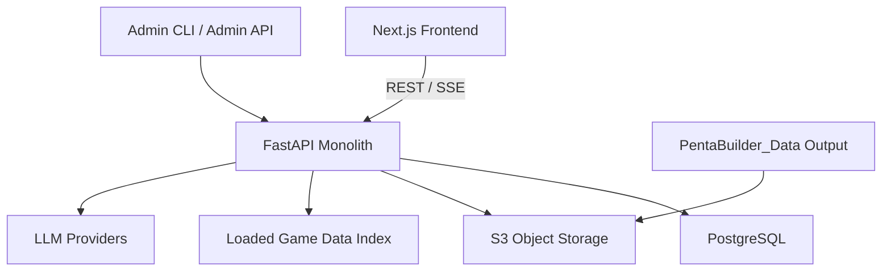
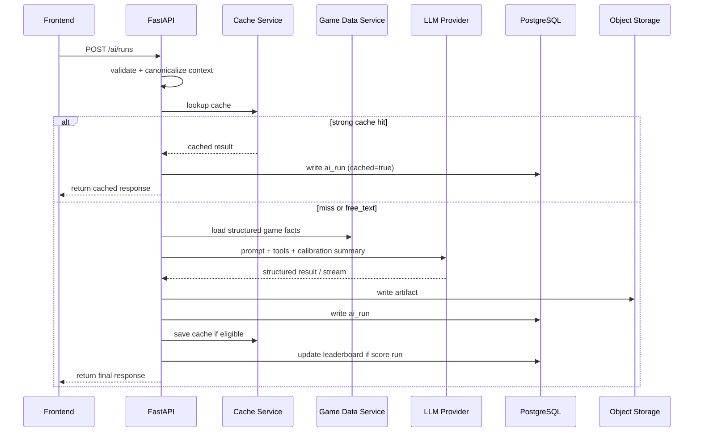

# PentaBuilder Backend Architecture Design

## 1. 目标与边界

`PentaBuilder_BE` 的职责不是存一份完整游戏数据库，而是作为一个 `Python monolith`，负责以下几类能力：

1. 对前端提供 `REST + SSE` API。
2. 从本地或 S3 加载当前 `data_version` 的游戏数据，并建立只读索引。
3. 运行 AI workflow：
   - 出装评分
   - 完整/局部推荐
   - 单槽位解释
   - 两套 build 对比
   - 继续追问
4. 保存用户会话、AI run 元数据、缓存结果、排行榜结果。
5. 运行离线工作流：
   - 默认基础出装预计算
   - 模型版本校准 workflow
   - benchmark workflow
6. 提供 admin 能力：
   - 刷新数据版本
   - 清理缓存
   - 触发离线任务

明确不做的事情：

- 不把 champions/items/runes 全量明细强行镜像进 PostgreSQL。
- 不在 v1 内做真正的分布式多服务拆分。
- 不在 v1 内做复杂 prompt 版本管理。
- 不在 v1 内把 `2-5` 个敌方英雄组合做离线预计算。

## 2. 已确认的核心产品约束

- 同时支持 `LoL PC` 和 `Wild Rift`。
- `match` 必须包含：
  - `game`
  - `data_version`
  - `own_champion`
- 其他上下文可选：
  - `enemy champions` 0-5 个
  - `enemy items/runes`
  - `current items/runes`
  - `battle environment tags`
  - `battle environment free text`
- 不建模 `role/lane`。
- `battle environment` 采用：
  - 预设标签
  - 可选自由文本
- 默认基础出装只预计算：
  - `own_champion + data_version`
- 其他上下文只缓存用户真实查询结果。
- `leaderboard` 只统计：
  - `我方英雄 + 单个敌方英雄`
  - `我方英雄 + 无敌方英雄`
- 登录方式：
  - 匿名试玩
  - Clerk 登录
  - admin 环境变量账号密码登录
- AI 长文本不放 PostgreSQL，放 object storage；数据库只存索引和结构化元数据。

## 3. 技术选型建议

### 3.1 API 与应用层

- `FastAPI`
- `Pydantic v2`
- `SQLAlchemy 2.x`
- `Alembic`
- `httpx`
- `uv`
- `LangGraph`

理由：

- FastAPI 对 `REST + SSE` 支持直接，和 Pydantic 的 JSON schema 约束也自然。
- 同一个 Python 代码库可以同时承载 API、admin CLI 和离线 workflow。
- `uv` 适合作为后端唯一的包管理与运行入口，避免 `pip/poetry` 混用。
- 对需要多步工具调用和结构化修复的 AI workflow，`LangGraph` 比自由形态 agent executor 更可控。

### 3.2 存储

- `PostgreSQL`：结构化业务数据
- `S3-compatible object storage`：会话 transcript、AI 长文本、benchmark artifact、calibration summary
- 本地文件系统：仅开发环境 fallback

### 3.3 部署

- Railway 部署 `API monolith`
- Railway PostgreSQL
- 外部 S3 bucket 继续作为对象存储与游戏数据来源

### 3.4 v1 不引入的基础设施

- 不强依赖 Redis
- 不强依赖消息队列
- 不强依赖独立 worker service

v1 的离线任务采用同仓库 CLI 手动触发即可；如果后续规模增长，再把 job execution 抽到独立 worker。

## 4. 系统上下文



## 5. 后端模块划分

建议后端代码按以下模块拆分：

```text
app/
├── api/
│   ├── routes/
│   ├── deps/
│   └── sse/
├── core/
│   ├── config.py
│   ├── logging.py
│   ├── security.py
│   └── enums.py
├── domain/
│   ├── match_context.py
│   ├── builds.py
│   ├── leaderboard.py
│   ├── sessions.py
│   └── cache_keys.py
├── services/
│   ├── auth_service.py
│   ├── game_data_service.py
│   ├── session_service.py
│   ├── run_service.py
│   ├── cache_service.py
│   ├── leaderboard_service.py
│   └── storage_service.py
├── ai/
│   ├── providers/
│   ├── llm_client_base.py
│   ├── prompts/
│   ├── tools/
│   ├── agents/
│   └── orchestration/
├── db/
│   ├── models/
│   ├── repositories/
│   └── session.py
├── jobs/
│   ├── precompute_baselines.py
│   ├── generate_calibration.py
│   ├── run_benchmarks.py
│   └── recalc_leaderboard.py
└── cli/
    └── main.py
```

## 6. 核心领域模型

## 6.1 Match Context

后端内部应该把所有 AI 请求统一成一个标准 `MatchContext`：

```json
{
  "game": "lol | wild_rift",
  "data_version": "full-20260412",
  "own_champion_slug": "lol-ahri",
  "enemy_team": [
    {
      "champion_slug": "lol-zed",
      "build": ["lol-eclipse", null, null, null, null, null],
      "runes": {
        "primary": [],
        "secondary": []
      }
    },
    {
      "champion_slug": "lol-lee-sin",
      "build": [null, null, null, null, null, null],
      "runes": {
        "primary": [],
        "secondary": []
      }
    }
  ],
  "own_build": ["lol-luden-s-echo", null, null, null, null, null],
  "own_runes": {
    "primary": [],
    "secondary": []
  },
  "environment": {
    "tags": ["ranked", "assassin-heavy"],
    "free_text": "对面爆发高，前期压力很大"
  }
}
```

关键约束：

- `enemy_team` 是外部正式输入结构，每个敌方英雄都可以带自己的 build/runes。
- 所有 champion/item/rune slug 统一使用带游戏前缀的 canonical 格式：
  - `lol-...` 表示 `LoL PC`
  - `wr-...` 表示 `Wild Rift`
- 即使 slug 已带前缀，`game` 字段仍然必须保留：
  - 后端用它校验 slug 前缀是否匹配
  - 前端用它明确展示当前工作区到底是 `LoL PC` 还是 `Wild Rift`
- 后端会从 `enemy_team` 派生 `enemy_champion_slugs_sorted`，用于 canonical form、缓存和 leaderboard。
- `environment.tags` 必须来自后端白名单枚举。
- `environment.free_text` 原样保存，但不参与强缓存键。

当前 v1 的 `environment.tags` 白名单定义为以下 canonical slug：

| canonical tag | 前端展示建议 |
|---|---|
| `aram` | `ARAM` |
| `ranked` | `Ranked` |
| `normal` | `Normal` |
| `tank-heavy` | `坦克多` |
| `assassin-heavy` | `刺客多` |
| `healing-heavy` | `回复多` |
| `ap-heavy` | `AP 多` |
| `ad-heavy` | `AD 多` |
| `cc-heavy` | `控制多` |
| `poke-heavy` | `消耗多` |
| `early-game` | `前期强势` |
| `late-game` | `后期发力` |

## 6.2 语言与展示偏好

用户请求还要附带展示偏好：

- `response_language`: `en` / `zh-CN`
- `terminology_style`:
  - `official`
  - `slang_zh`

这个偏好会影响最终返回文本，但不应该改变“语义上的 build 结论”。

因此后端应使用两层 key：

1. `semantic_context_key`
2. `response_variant_key`

其中：

- `semantic_context_key` 用于表达“同一个问题”
- `response_variant_key` 用于表达“同一个问题的不同语言输出变体”

## 6.3 Session 与 Run

必须明确区分两个概念：

### Session

表示一次前端工作区生命周期。

- 每次用户打开 builder，前端都生成一个新的 `client_session_id`
- 如果用户已登录，前端可主动调用 `POST /sessions` 创建持久化 `server_session`
- 如果用户匿名，则前端仅本地维护 session 历史；登录后可选择 claim 当前 session 并持久化
- v1 不为匿名用户自动创建后端持久化 session

### AI Run

表示一次具体的 AI 执行。

run type 建议定义为：

- `evaluate_build`
- `recommend_slot`
- `recommend_full_build`
- `explain_slot`
- `compare_builds`
- `chat_followup`
- `version_calibration`
- `benchmark_case`

一个 session 中会包含多个 run。

## 7. 数据来源与版本管理

## 7.1 Source of Truth

### 游戏数据

游戏数据的 source of truth 仍然是：

- S3 bucket 中按 `data_version` 存储的 processed JSON
- 或开发环境下的本地镜像目录

后端只读取，不把整份游戏数据写进 PostgreSQL。

### 业务衍生数据

以下内容才进入 PostgreSQL：

- 用户
- 会话索引
- AI run 元数据
- baseline builds
- cache entries
- leaderboard entries
- model calibration metadata
- benchmark metadata

## 7.2 Data Version

`data_version` 不是 Riot patch version，而是你的数据快照版本。

建议约束：

- 版本字符串必须全局唯一
- 可以人工指定，但后端不做“同名覆盖”
- 一旦激活为当前版本：
  - 清理强缓存
  - 保留旧版本数据用于历史查询
  - 前端默认只显示当前版本 leaderboard 和 baseline

同时保留可选 metadata：

- `lol_patch_version`
- `wild_rift_patch_version`

这两个字段只用于展示，不参与主版本键。

## 7.3 游戏数据加载方式

`GameDataService` 在进程内维护当前激活版本的只读索引：

- champions by slug
- items by slug
- runes by slug
- name/alias lookup index
- category/tag lookup index

为了支持中英双语与中文黑话，建议增加一层 supplemental localization asset：

```text
game_localization/
├── lol/
│   ├── champions.zh-CN.json
│   ├── champions.en.json
│   ├── items.zh-CN.json
│   ├── items.en.json
│   ├── runes.zh-CN.json
│   └── runes.en.json
└── wild_rift/
    ├── champions.zh-CN.json
    ├── champions.en.json
    ├── items.zh-CN.json
    ├── items.en.json
    ├── runes.zh-CN.json
    └── runes.en.json
```

每个条目至少包含：

- `slug`
- `en_name`
- `zh_official_name`
- `zh_aliases[]`

可选扩展：

- `localized_display_names.{language}`

这样前端和 AI 都能统一通过 slug 工作，展示层再根据偏好渲染名称。

补充约束：

- 本地化资产里的 slug 也必须使用同一套 canonical 规则：
  - `lol-ahri`
  - `wr-ahri`
- 中文官方名和中文黑话映射将以单独资产生成，并允许人工补充修订。
- 这份资产可以来自本地镜像目录，也可以来自 S3 / Blob Storage 挂载路径。

## 8. PostgreSQL 逻辑模型

这里给的是架构级设计，不是最终 migration 文件。

## 8.1 `users`

用途：登录用户基础资料。

建议字段：

- `id`
- `auth_provider` (`clerk`)
- `auth_subject`
- `email`
- `email_verified`
- `display_name`
- `username`
- `icon_url`
- `preferred_language`
- `preferred_terminology_style`
- `created_at`
- `updated_at`

唯一键建议：

- unique(`auth_provider`, `auth_subject`)

注意：

- 不对 `email` 加全局唯一约束，因为真正稳定的登录身份应以 `auth_subject` 为准，而不是邮箱。

## 8.2 `data_versions`

用途：记录可用游戏数据版本。

建议字段：

- `id`
- `data_version`
- `manifest_object_key`
- `source_root`
- `lol_patch_version` nullable
- `wild_rift_patch_version` nullable
- `is_active`
- `created_at`
- `activated_at`

## 8.3 `sessions`

用途：索引持久化的用户 session。

建议字段：

- `id`
- `user_id`
- `game`
- `data_version`
- `title`
- `last_context_snapshot` JSONB
- `transcript_object_key`
- `event_count`
- `created_at`
- `updated_at`

说明：

- 只为已登录且选择保存的 session 建立正式记录。
- 匿名会话默认只在前端本地保留，不进入持久化层。

## 8.4 `ai_runs`

用途：保存每次 AI 调用的结构化元数据。

建议字段：

- `id`
- `session_id` nullable
- `user_id` nullable
- `run_type`
- `status`
- `game`
- `data_version`
- `operation_context` JSONB
- `semantic_context_key`
- `response_variant_key`
- `cached_entry_id` nullable
- `provider_name`
- `model_name`
- `tokens_input`
- `tokens_output`
- `cost_usd`
- `latency_ms`
- `score_value` nullable
- `structured_result` JSONB
- `artifact_object_key` nullable
- `error_message` nullable
- `created_at`

这里不保存完整长文本，只保存：

- 结构化结果
- 对象存储引用
- 调用成本/延迟

## 8.5 `baseline_builds`

用途：保存默认基础出装/符文。

粒度：

- `game + data_version + own_champion_slug`

建议字段：

- `id`
- `game`
- `data_version`
- `own_champion_slug`
- `recommended_build` JSONB
  - 保存 `recommend_full_build` 的 ordered build path
  - LoL PC: 长度固定为 `6`
  - Wild Rift: 长度固定为 `7`
  - Wild Rift 的 `7` 步表示鞋子与附魔分开建模
- `recommended_runes` JSONB
- `model_name`
- `source_run_id`
- `created_at`

## 8.6 `cached_context_results`

用途：保存强缓存结果。

只缓存满足以下条件的请求：

- 无 `free_text`
- 结构化上下文可 canonicalize
- run type 属于可缓存集合

建议字段：

- `id`
- `run_type`
- `game`
- `data_version`
- `own_champion_slug`
- `enemy_comp_key`
- `enemy_count`
- `normalized_environment_key`
- `semantic_context_key`
- `response_variant_key`
- `language`
- `terminology_style`
- `structured_result` JSONB
- `artifact_object_key`
- `source_run_id`
- `hit_count`
- `created_at`
- `last_hit_at`

## 8.7 `leaderboard_entries`

用途：保存排行榜当前结果。

统计粒度：

- `game`
- `data_version`
- `own_champion_slug`
- `enemy_champion_slug nullable`

建议字段：

- `id`
- `game`
- `data_version`
- `own_champion_slug`
- `enemy_champion_slug` nullable
- `top_run_id`
- `top_session_id`
- `top_user_id`
- `top_score`
- `updated_at`

注意：

- 不按完整敌方阵容统计。
- 不按自由文本环境统计。

## 8.8 `model_calibrations`

用途：保存 `(model, game, data_version)` 的版本校准结果。

建议字段：

- `id`
- `provider_name`
- `model_name`
- `game`
- `data_version`
- `summary_object_key`
- `summary_excerpt`
- `status`
- `generated_at`

## 8.9 benchmark 相关表

至少应包括：

- `benchmark_datasets`
- `benchmark_cases`
- `benchmark_runs`
- `benchmark_results`

其中：

- dataset 描述一批人工标注题集
- case 描述单个题目
- run 描述一次模型批测
- result 描述某个模型在某个 case 上的得分、成本、时延

## 9. Object Storage 设计

## 9.1 Session Transcript

每个持久化 session 存一个 JSON 文件：

```json
{
  "session_id": "uuid",
  "user_id": "uuid",
  "game": "lol",
  "data_version": "full-20260412",
  "created_at": "2026-04-12T10:00:00Z",
  "updated_at": "2026-04-12T10:30:00Z",
  "events": [
    {
      "event_id": "uuid",
      "type": "user_action",
      "action": "recommend_slot",
      "timestamp": "2026-04-12T10:01:00Z",
      "payload": {}
    },
    {
      "event_id": "uuid",
      "type": "ai_run",
      "run_id": "uuid",
      "timestamp": "2026-04-12T10:01:05Z",
      "artifact_key": "..."
    }
  ]
}
```

这样设计的好处：

- 用户历史回看简单
- 一个 session 只需要一个对象 key
- 删除用户 session 时可以同步删单个文件

## 9.2 AI Artifact

虽然 session transcript 是主对象，但单次 run 仍建议有独立 artifact JSON：

- 便于 debug
- 便于 benchmark/审计复用
- 便于从 session transcript 外部独立读取某次 run

artifact 建议包含：

- 输入上下文快照
- 模型最终结构化输出
- 渲染后的用户可读文本
- tool call trace
- calibration summary 摘要

## 9.3 路径建议

```text
sessions/{user_id}/{session_id}.json
runs/{data_version}/{run_type}/{run_id}.json
calibrations/{data_version}/{game}/{model_name}.json
benchmarks/{dataset_id}/{benchmark_run_id}.json
```

## 10. 缓存设计

## 10.1 强缓存命中条件

强缓存仅适用于以下请求：

- `evaluate_build`
- `recommend_slot`
- `recommend_full_build`
- `explain_slot`
- `compare_builds`

并且必须满足：

- `free_text` 为空
- `enemy_team` 已规范化，且已成功派生 `enemy_champion_slugs_sorted`
- `environment.tags` 全部来自枚举

## 10.2 语义键

核心语义键建议由以下字段组成：

- `game`
- `data_version`
- `own_champion_slug`
- `enemy_comp_key`
- `normalized_environment_key`

其中：

- `enemy_comp_key` 是排序后的 enemy slug 列表拼接
- `normalized_environment_key` 是排序后的标签集合拼接

## 10.3 输出变体键

在语义键基础上追加：

- `run_type`
- `response_language`
- `terminology_style`

得到 `response_variant_key`。

## 10.4 带自由文本时的策略

当用户提供了 `free_text`：

1. 不做强缓存直接返回
2. 仍尝试按结构化部分查找 `semantic_context_key`
3. 若查到缓存结果：
   - 作为 `reference context` 附到模型输入中
   - 不直接原样返回
4. 若查不到：
   - 直接走模型推理

这和你在澄清里给出的产品意图一致。

## 10.5 缓存失效

以下情况清理缓存：

- `data_version` 切换
- admin 手动清理
- 对应缓存对象损坏或 schema 升级不兼容

v1 不因为 model 改动自动失效缓存。

## 11. AI 系统设计

## 11.1 LLM 抽象层

需要一个统一基类 `BaseLLMClient`，屏蔽 provider 差异：

- 同步/异步调用
- streaming
- tool calling
- token 统计
- cost 统计
- 超时与错误转换

建议接口：

```python
class BaseLLMClient(ABC):
    async def generate(self, request: LLMRequest) -> LLMResponse: ...
    async def stream(self, request: LLMRequest) -> AsyncIterator[LLMStreamEvent]: ...
```

## 11.2 Tool Layer

模型可调用的只读工具建议包括：

- `get_champion(game, slug)`
- `get_item(game, slug)`
- `get_rune(game, slug)`
- `batch_get_entities(game, entity_type, slugs)`
- `search_catalog(game, entity_type, query_or_tags)`
- `list_catalog_candidates(game, entity_type, filters)`
- `resolve_catalog_slug(game, entity_type, raw_name, filters)`

`baseline`、`calibration summary`、`reference cache summary`、`session memory summary`
这类上下文由服务层先注入，不作为 model-visible tools。

工具只访问进程内已加载的只读索引，不直接打数据库重查询。

额外约束：

- 主 LLM 只在 slug 已确认时才调用 `get_*` / `batch_get_entities`
- slug 未确认时，优先调用 `resolve_catalog_slug`
- `resolve_catalog_slug` 内部允许先按 filter 做 `list_catalog_candidates`，再用 deterministic ranking + cheap selector model 收敛到一个 canonical slug

## 11.3 Agent 设计

### Agent 1: 出装评分 Agent

输入：

- 完整或近完整的 `MatchContext`

输出：

- 单一分数
- 总体评价
- 关键优点
- 关键问题
- 更优 build/runes 建议

### Agent 2: 推荐 Agent

输入：

- 不完整的 `MatchContext`

输出：

- 要填充的槽位
- 推荐 build/runes
- 原因
- 可选替代说明

### Agent 3: 答疑 Agent

输入：

- 完整或不完整的 `MatchContext`
- 目标槽位或目标 rune
- 用户追问文本

输出：

- 为什么当前选择合理/不合理
- 当前上下文下更优选择
- 若需要，指出前面哪些槽位应联动调整

### Agent 4: 对比 Agent

输入：

- 两个完整度相同的 build context

输出：

- 哪个更好
- 差异主要来自哪些槽位/符文
- 为什么

## 11.4 版本校准 Workflow

目标：

- 为每个 `(model, game, data_version)` 生成一份 summary
- 告诉模型“当前版本和其内置知识相比有哪些变化”

消费方式：

- 该 summary 会在后续线上推理时自动附到 prompt 中

建议流程：

1. 按 batch 读取当前版本的 champions/items/runes
2. 让模型标记可能与其已有知识不一致的条目
3. 汇总差异
4. 生成 calibration summary
5. 存对象存储
6. 写 `model_calibrations`

注意：

- 这不是数据真值验证系统
- 它只是模型知识校准层

## 11.5 Benchmark Workflow

输入：

- 人工标注集
- 候选模型列表

候选模型首批集合：

- `GPT-5.4-xhigh`
- `GPT-5.4-medium`
- `GPT-5.4-mini-xhigh`
- `GPT-5.4-mini-medium`
- `Gemini-3.1-pro`
- `Gemini-3-flash`
- `Gemini-2.5-flash`

输出指标：

- accuracy
- latency
- cost

建议 benchmark 结果按：

- `dataset`
- `game`
- `run_type`
- `model`

四个维度聚合。

## 12. 请求处理流程

## 12.1 评分/推荐/解释/对比统一流程



## 12.2 Session 保存流程

### 已登录用户

1. FE 创建/拿到 `server_session_id`
2. 所有操作都 append 为 session event
3. 定期或每次 run 完成后刷新 transcript object
4. `sessions` 表只保存对象 key 和最后状态

### 匿名用户

1. FE 只维护本地 `client_session_id`
2. 本地保留 event buffer
3. 若用户登录并选择保存当前会话：
   - FE 将 buffer 提交给后端
   - 后端创建 `sessions` row 和 transcript object

## 12.3 删除 Session

你要求同步删除 bucket 原文，因此 delete session 流程建议是：

1. 查询 session row 与 transcript key
2. 删除 transcript object
3. 删除相关 run artifact object
4. 删除 `ai_runs`
5. 删除 `sessions`
6. 若该 session 影响 leaderboard：
   - 立即重算受影响的 `(game, data_version, own_champion, enemy_champion)`

这会比异步清理更贵，但符合你的要求。

## 13. API 设计原则

这里只给结构，不展开成完整 OpenAPI。

## 13.1 Auth

- `POST /api/v1/auth/exchange`
- `GET /api/v1/me`
- `PATCH /api/v1/me/preferences`

普通用户登录统一通过 Clerk；后端只验证 Clerk 发出的 token / session。

admin 接口不依赖 Clerk role，v1 直接使用环境变量里的固定账号密码做鉴权。

## 13.2 Catalog

- `GET /api/v1/catalog/versions/current`
- `GET /api/v1/catalog/{game}/champions`
- `GET /api/v1/catalog/{game}/items`
- `GET /api/v1/catalog/{game}/runes`
- `GET /api/v1/catalog/{game}/lookup?q=...`

## 13.3 Sessions

- `POST /api/v1/sessions`
- `GET /api/v1/sessions`
- `GET /api/v1/sessions/{session_id}`
- `DELETE /api/v1/sessions/{session_id}`
- `POST /api/v1/sessions/{session_id}/claim`

## 13.4 AI Runs

- `POST /api/v1/ai/runs`
- `GET /api/v1/ai/runs/{run_id}`
- `GET /api/v1/ai/runs/{run_id}/events`

建议模式：

- `POST /ai/runs` 创建 run
- `recommend_full_build` / `explain_slot` / `chat_followup` 建议使用 `stream=true`
- 其他以结构化 JSON 为主的 run 默认直接走非流式响应
- 若 `stream=true`，返回 `run_id` 和 SSE URL
- FE 再订阅 `GET /ai/runs/{run_id}/events`

## 13.5 Leaderboard

- `GET /api/v1/leaderboard`
- `GET /api/v1/leaderboard/{game}/{own_champion_slug}`

## 13.6 Admin

- `POST /api/v1/admin/data-versions/activate`
- `POST /api/v1/admin/cache/clear`
- `POST /api/v1/admin/jobs/precompute-baselines`
- `POST /api/v1/admin/jobs/generate-calibrations`
- `POST /api/v1/admin/jobs/run-benchmarks`

## 14. 安全与风控

虽然你暂时不做 rate limit，但后端至少要做这些最基本保护：

- 输入长度限制
- slug 白名单校验
- free text 清洗
- prompt injection guardrail
- 工具调用白名单
- admin API 鉴权

至少要记录：

- `request_id`
- `session_id`
- `run_id`
- `user_id`
- `model_name`
- `latency_ms`
- `token/cost`
- `cache_hit`

## 15. 可观测性

重点指标按你确认的需求设计：

- 请求成功率
- token/cost
- 模型延迟
- 推荐命中缓存率

建议加两类辅助指标：

- 各 run type 的错误率
- 各数据版本的缓存命中率

## 16. 实施顺序建议

建议实现顺序如下：

1. `catalog + game data loader`
2. `auth integration`
3. `session + ai_runs + object storage`
4. `evaluate_build / recommend_build / explain_slot` 基础链路
5. `cache + leaderboard`
6. `compare_builds`
7. `model calibration workflow`
8. `benchmark workflow`

这样可以先跑通主产品闭环，再补离线能力。
