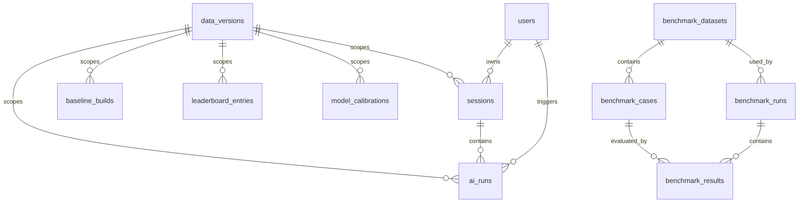

# PentaBuilder Backend Database Schema Design

## 1. 文档目标

这份文档把 [ARCHITECTURE_DESIGN.md](/Users/jialinliu/Dev/PentaBuilder/PentaBuilder_BE/docs/ARCHITECTURE_DESIGN.md) 里的数据库部分展开成可落地的 PostgreSQL 设计。

目标是回答四个问题：

1. 哪些数据进入 PostgreSQL，哪些不进入。
2. 表之间如何关联。
3. 常见查询如何高效执行。
4. 删除、缓存、排行榜、benchmark 这些“边缘逻辑”如何不把 schema 弄乱。

## 2. 设计原则

## 2.1 PostgreSQL 只存业务索引和结构化元数据

不进入 PostgreSQL 的内容：

- champions / items / runes 全量明细
- AI 长文本原文
- session transcript 原文
- calibration summary 原文
- benchmark artifact 原文

这些内容放 object storage，只在 DB 中保存：

- object key
- 摘要信息
- 结构化结果

## 2.2 主键统一使用 UUID

所有业务表都使用 `UUID` 作为主键，原因：

- 便于前后端分离
- 便于 object storage 命名
- 便于之后拆服务

## 2.3 枚举优先使用 `TEXT + CHECK`

v1 不推荐大量 PostgreSQL enum type。

原因：

- 迁移成本更低
- 迭代 run type / status / provider 时更灵活

## 2.4 复杂上下文使用 `JSONB + 规范化字段`

所有 AI 上下文都很适合以 JSONB 存储，但如果完全只存 JSONB，查询和唯一约束会变差。

所以采用混合策略：

- `operation_context` / `structured_result` 放 `JSONB`
- 高频过滤字段拆成独立列
- 需要去重的上下文额外保存 canonical hash

## 2.5 强缓存用“规范化 hash”，不用原始自由文本

缓存命中的语义依据来自：

- `game`
- `data_version`
- `own_champion`
- `enemy_comp`
- `normalized_environment_tags`
- `run_type`
- `response_language`
- `terminology_style`

自由文本不参与强缓存。

## 3. 需要的表

建议 v1 使用以下 13 张核心表：

1. `users`
2. `data_versions`
3. `sessions`
4. `ai_runs`
5. `baseline_builds`
6. `cached_context_results`
7. `leaderboard_entries`
8. `model_calibrations`
9. `benchmark_datasets`
10. `benchmark_cases`
11. `benchmark_runs`
12. `benchmark_results`
13. `admin_job_runs`

## 4. 逻辑关系图



## 5. 公共字段约定

所有表建议默认包含：

- `id UUID PRIMARY KEY`
- `created_at TIMESTAMPTZ NOT NULL DEFAULT now()`
- `updated_at TIMESTAMPTZ NOT NULL DEFAULT now()`

如果某表是 append-only，可不需要 `updated_at`。

所有 champion / item / rune slug 相关字段统一保存 canonical 值：

- `lol-...`
- `wr-...`

即使 slug 自带前缀，`game` 字段仍然必须保留，便于前端明确当前游戏类型，也便于后端做一致性校验。

## 6. 详细表设计

## 6.1 `users`

用途：

- 保存登录用户资料
- 保存用户偏好
- 与 auth provider 建立稳定映射

### 推荐字段

| 字段 | 类型 | 约束 | 说明 |
|---|---|---|---|
| `id` | `UUID` | PK | 用户主键 |
| `auth_provider` | `TEXT` | NOT NULL | `clerk` |
| `auth_subject` | `TEXT` | NOT NULL | Clerk 给出的稳定 user id / subject |
| `email` | `TEXT` | NULL | 允许为空，且不全局唯一 |
| `email_verified` | `BOOLEAN` | NOT NULL DEFAULT false | 邮箱是否被 provider 验证 |
| `display_name` | `TEXT` | NULL | 用户在系统中的展示名 |
| `username` | `TEXT` | NULL | 自定义用户名，用于 leaderboard |
| `icon_url` | `TEXT` | NULL | 头像地址 |
| `preferred_language` | `TEXT` | NOT NULL DEFAULT 'zh-CN' | `zh-CN` / `en` |
| `preferred_terminology_style` | `TEXT` | NOT NULL DEFAULT 'official' | `official` / `slang_zh` |
| `created_at` | `TIMESTAMPTZ` | NOT NULL | 创建时间 |
| `updated_at` | `TIMESTAMPTZ` | NOT NULL | 更新时间 |

### 约束

- unique(`auth_provider`, `auth_subject`)
- check(`auth_provider` in `('clerk')`)
- check(`preferred_language` in `('zh-CN','en')`)
- check(`preferred_terminology_style` in `('official','slang_zh')`)

### 索引

- index on `email`
- index on `username`

### 设计备注

- `email` 仍然不建议做全局唯一，因为它只是一份展示和联系信息，不应替代 `auth_subject`。
- `username` 可以允许为空；若要做唯一用户名，可在后续版本增加唯一约束。

## 6.2 `data_versions`

用途：

- 记录当前可用的数据快照版本
- 保存其 manifest 与展示 metadata

### 推荐字段

| 字段 | 类型 | 约束 | 说明 |
|---|---|---|---|
| `id` | `UUID` | PK | 主键 |
| `data_version` | `TEXT` | NOT NULL UNIQUE | 例如 `full-20260412` |
| `manifest_object_key` | `TEXT` | NOT NULL | 指向 manifest.json |
| `source_root` | `TEXT` | NOT NULL | 数据根路径 |
| `lol_patch_version` | `TEXT` | NULL | 可选展示字段 |
| `wild_rift_patch_version` | `TEXT` | NULL | 可选展示字段 |
| `is_active` | `BOOLEAN` | NOT NULL DEFAULT false | 当前前台展示版本 |
| `created_at` | `TIMESTAMPTZ` | NOT NULL | 创建时间 |
| `activated_at` | `TIMESTAMPTZ` | NULL | 激活时间 |

### 索引

- unique partial index on `is_active = true`

### 设计备注

- `data_version` 是你的业务主版本，不是 Riot patch version。
- 任何排行榜、缓存、baseline 都必须带 `data_version`。

## 6.3 `sessions`

用途：

- 保存已持久化的用户 session 索引
- 指向该 session 的 transcript 对象

### 推荐字段

| 字段 | 类型 | 约束 | 说明 |
|---|---|---|---|
| `id` | `UUID` | PK | session 主键 |
| `user_id` | `UUID` | NOT NULL FK users(id) | 所属用户 |
| `client_session_id` | `TEXT` | NULL | 前端本地 session id，用于 claim |
| `game` | `TEXT` | NOT NULL | `lol` / `wild_rift` |
| `data_version` | `TEXT` | NOT NULL FK data_versions(data_version) | session 使用的数据版本 |
| `title` | `TEXT` | NULL | session 标题 |
| `last_context_snapshot` | `JSONB` | NOT NULL | 最近一次上下文快照 |
| `transcript_object_key` | `TEXT` | NOT NULL | session transcript 路径 |
| `event_count` | `INTEGER` | NOT NULL DEFAULT 0 | 已写入事件数 |
| `created_at` | `TIMESTAMPTZ` | NOT NULL | 创建时间 |
| `updated_at` | `TIMESTAMPTZ` | NOT NULL | 更新时间 |

### 约束

- check(`game` in `('lol','wild_rift')`)

### 索引

- index on (`user_id`, `updated_at desc`)
- index on (`data_version`, `updated_at desc`)
- unique index on `client_session_id` where `client_session_id is not null`

### 设计备注

- 匿名用户默认不写 `sessions` 表；只有登录后保存/claim 才真正落库。
- `last_context_snapshot` 让历史页列表可以快速显示最近 build，不必每次读取 transcript 大对象。

## 6.4 `ai_runs`

用途：

- 保存每次 AI 调用的结构化元数据
- 支撑 run detail、成本统计、错误分析、排行榜计算

### 推荐字段

| 字段 | 类型 | 约束 | 说明 |
|---|---|---|---|
| `id` | `UUID` | PK | run 主键 |
| `session_id` | `UUID` | NULL FK sessions(id) | 所属 session，可为空 |
| `user_id` | `UUID` | NULL FK users(id) | 所属用户，可为空 |
| `run_type` | `TEXT` | NOT NULL | AI 任务类型 |
| `status` | `TEXT` | NOT NULL | `accepted` / `streaming` / `completed` / `failed` / `cancelled` |
| `game` | `TEXT` | NOT NULL | `lol` / `wild_rift` |
| `data_version` | `TEXT` | NOT NULL FK data_versions(data_version) | 使用的数据版本 |
| `own_champion_slug` | `TEXT` | NULL | 高频过滤字段；使用 `lol-...` / `wr-...` |
| `enemy_comp_key` | `TEXT` | NULL | 排序后的敌方英雄 key |
| `normalized_environment_key` | `TEXT` | NULL | 排序后的标签 key |
| `has_free_text_environment` | `BOOLEAN` | NOT NULL DEFAULT false | 是否带自由文本 |
| `operation_context` | `JSONB` | NOT NULL | 完整请求上下文快照 |
| `semantic_context_hash` | `CHAR(64)` | NULL | 只包含语义上下文的 hash |
| `response_variant_hash` | `CHAR(64)` | NULL | 含语言与术语风格的 hash |
| `cache_resolution` | `TEXT` | NOT NULL DEFAULT 'miss' | `miss` / `strong_hit` / `reference_used` / `bypass` |
| `cached_entry_id` | `UUID` | NULL FK cached_context_results(id) | 命中的缓存行 |
| `provider_name` | `TEXT` | NULL | 例如 `google` |
| `model_name` | `TEXT` | NULL | 例如 `gemini-3.1-pro` |
| `tokens_input` | `INTEGER` | NULL | 输入 token |
| `tokens_output` | `INTEGER` | NULL | 输出 token |
| `cost_usd` | `NUMERIC(12,6)` | NULL | 费用 |
| `latency_ms` | `INTEGER` | NULL | 总耗时 |
| `score_value` | `SMALLINT` | NULL | 0-100 分 |
| `structured_result` | `JSONB` | NULL | 结构化输出 |
| `artifact_object_key` | `TEXT` | NULL | run artifact 路径 |
| `error_code` | `TEXT` | NULL | 失败错误码 |
| `error_message` | `TEXT` | NULL | 失败信息 |
| `created_at` | `TIMESTAMPTZ` | NOT NULL | 创建时间 |

### 约束

- check(`game` in `('lol','wild_rift')`)
- check(`status` in `('accepted','streaming','completed','failed','cancelled')`)
- check(`cache_resolution` in `('miss','strong_hit','reference_used','bypass')`)
- check(`score_value is null or score_value between 0 and 100`)

### 索引

- index on (`session_id`, `created_at`)
- index on (`user_id`, `created_at desc`)
- index on (`game`, `data_version`, `run_type`, `created_at desc`)
- index on (`game`, `data_version`, `own_champion_slug`, `created_at desc`)
- index on `semantic_context_hash`
- index on `response_variant_hash`
- index on (`cache_resolution`, `created_at desc`)

### 设计备注

- `operation_context` 是审计真相，后续任何 leaderboard 或 debug 都应该以它为准。
- `structured_result` 应只保存结构化字段，不保存最终长文本全文。
- `response_variant_hash` 主要服务缓存和语言变体定位。

## 6.5 `baseline_builds`

用途：

- 保存默认基础出装/符文
- 粒度固定为 `game + data_version + own_champion_slug`

### 推荐字段

| 字段 | 类型 | 约束 | 说明 |
|---|---|---|---|
| `id` | `UUID` | PK | 主键 |
| `game` | `TEXT` | NOT NULL | 游戏 |
| `data_version` | `TEXT` | NOT NULL FK data_versions(data_version) | 数据版本 |
| `own_champion_slug` | `TEXT` | NOT NULL | 我方英雄 |
| `recommended_build` | `JSONB` | NOT NULL | 6 槽装备 |
| `recommended_runes` | `JSONB` | NOT NULL | 默认符文 |
| `provider_name` | `TEXT` | NULL | 来源 provider |
| `model_name` | `TEXT` | NULL | 来源模型 |
| `source_run_id` | `UUID` | NULL FK ai_runs(id) | 生成它的 run |
| `created_at` | `TIMESTAMPTZ` | NOT NULL | 创建时间 |

### 约束

- unique(`game`, `data_version`, `own_champion_slug`)

### 索引

- index on (`data_version`, `game`)

## 6.6 `cached_context_results`

用途：

- 保存可直接复用的强缓存结果
- 只针对没有自由文本的结构化请求

### 推荐字段

| 字段 | 类型 | 约束 | 说明 |
|---|---|---|---|
| `id` | `UUID` | PK | 主键 |
| `run_type` | `TEXT` | NOT NULL | 缓存对应的任务类型 |
| `game` | `TEXT` | NOT NULL | 游戏 |
| `data_version` | `TEXT` | NOT NULL FK data_versions(data_version) | 数据版本 |
| `own_champion_slug` | `TEXT` | NOT NULL | 我方英雄 |
| `enemy_comp_key` | `TEXT` | NOT NULL | 排序后的敌方英雄组合 |
| `enemy_count` | `SMALLINT` | NOT NULL | 敌方英雄数量 |
| `normalized_environment_key` | `TEXT` | NOT NULL | 排序后的环境标签 key |
| `semantic_context_hash` | `CHAR(64)` | NOT NULL | 语义 key hash |
| `response_variant_hash` | `CHAR(64)` | NOT NULL | 输出变体 key hash |
| `language` | `TEXT` | NOT NULL | 输出语言 |
| `terminology_style` | `TEXT` | NOT NULL | 输出术语风格 |
| `structured_result` | `JSONB` | NOT NULL | 结构化结果 |
| `artifact_object_key` | `TEXT` | NOT NULL | 结果原文对象路径 |
| `source_run_id` | `UUID` | NOT NULL FK ai_runs(id) | 产生该缓存的 run |
| `hit_count` | `INTEGER` | NOT NULL DEFAULT 0 | 命中次数 |
| `created_at` | `TIMESTAMPTZ` | NOT NULL | 创建时间 |
| `last_hit_at` | `TIMESTAMPTZ` | NULL | 最近命中时间 |

### 约束

- check(`game` in `('lol','wild_rift')`)
- check(`language` in `('zh-CN','en')`)
- check(`terminology_style` in `('official','slang_zh')`)
- check(`enemy_count between 0 and 5`)

### 唯一约束

- unique(`run_type`, `response_variant_hash`)

### 索引

- index on (`game`, `data_version`, `own_champion_slug`)
- index on (`semantic_context_hash`)
- index on (`last_hit_at desc`)

### 设计备注

- 强缓存直接按 `response_variant_hash` 命中。
- 带自由文本时，只能按 `semantic_context_hash` 去找“参考缓存”，不能直接返回。

## 6.7 `leaderboard_entries`

用途：

- 保存当前 leaderboard 的聚合结果

统计粒度：

- `game`
- `data_version`
- `own_champion_slug`
- `enemy_champion_slug nullable`

### 推荐字段

| 字段 | 类型 | 约束 | 说明 |
|---|---|---|---|
| `id` | `UUID` | PK | 主键 |
| `game` | `TEXT` | NOT NULL | 游戏 |
| `data_version` | `TEXT` | NOT NULL FK data_versions(data_version) | 数据版本 |
| `own_champion_slug` | `TEXT` | NOT NULL | 我方英雄 |
| `enemy_champion_slug` | `TEXT` | NULL | 敌方单英雄；为空表示“不考虑敌方英雄” |
| `top_run_id` | `UUID` | NOT NULL FK ai_runs(id) | 最高分 run |
| `top_session_id` | `UUID` | NULL FK sessions(id) | 对应 session |
| `top_user_id` | `UUID` | NULL FK users(id) | 对应用户 |
| `top_username_snapshot` | `TEXT` | NULL | 排名时展示的用户名快照 |
| `top_score` | `SMALLINT` | NOT NULL | 最高分 |
| `updated_at` | `TIMESTAMPTZ` | NOT NULL | 更新时间 |

### 约束

- `top_score between 0 and 100`

### 唯一约束

因为 `enemy_champion_slug` 允许为 `NULL`，不能直接依赖普通 unique constraint。

推荐使用表达式唯一索引：

```sql
create unique index uq_leaderboard_scope
on leaderboard_entries (
  game,
  data_version,
  own_champion_slug,
  coalesce(enemy_champion_slug, '_none')
);
```

### 索引

- index on (`game`, `data_version`, `top_score desc`)
- index on (`game`, `data_version`, `own_champion_slug`, `top_score desc`)

### 设计备注

- 保存 `top_username_snapshot` 是为了避免前台列表每次 join 用户表。
- 用户删除后应重算其影响到的 leaderboard entry，而不是长期保留“悬空冠军”。

## 6.8 `model_calibrations`

用途：

- 保存每个 `(provider, model, game, data_version)` 的版本校准结果

### 推荐字段

| 字段 | 类型 | 约束 | 说明 |
|---|---|---|---|
| `id` | `UUID` | PK | 主键 |
| `provider_name` | `TEXT` | NOT NULL | provider |
| `model_name` | `TEXT` | NOT NULL | 模型 |
| `game` | `TEXT` | NOT NULL | 游戏 |
| `data_version` | `TEXT` | NOT NULL FK data_versions(data_version) | 数据版本 |
| `status` | `TEXT` | NOT NULL | `pending` / `completed` / `failed` |
| `summary_object_key` | `TEXT` | NULL | summary 路径 |
| `summary_excerpt` | `TEXT` | NULL | 页面/日志显示摘要 |
| `source_run_id` | `UUID` | NULL FK ai_runs(id) | 生成 summary 的 run |
| `generated_at` | `TIMESTAMPTZ` | NULL | 生成时间 |
| `created_at` | `TIMESTAMPTZ` | NOT NULL | 创建时间 |

### 约束

- unique(`provider_name`, `model_name`, `game`, `data_version`)
- check(`status` in `('pending','completed','failed')`)

## 6.9 `benchmark_datasets`

用途：

- 描述一组 benchmark 用例集合

### 推荐字段

| 字段 | 类型 | 约束 | 说明 |
|---|---|---|---|
| `id` | `UUID` | PK | 主键 |
| `name` | `TEXT` | NOT NULL UNIQUE | 数据集名 |
| `game` | `TEXT` | NOT NULL | 游戏 |
| `data_version` | `TEXT` | NOT NULL FK data_versions(data_version) | 标注集针对的数据版本 |
| `description` | `TEXT` | NULL | 描述 |
| `labeling_status` | `TEXT` | NOT NULL DEFAULT 'draft' | `draft` / `ready` / `archived` |
| `created_at` | `TIMESTAMPTZ` | NOT NULL | 创建时间 |
| `updated_at` | `TIMESTAMPTZ` | NOT NULL | 更新时间 |

### 约束

- check(`game` in `('lol','wild_rift')`)
- check(`labeling_status` in `('draft','ready','archived')`)

## 6.10 `benchmark_cases`

用途：

- benchmark 单题

### 推荐字段

| 字段 | 类型 | 约束 | 说明 |
|---|---|---|---|
| `id` | `UUID` | PK | 主键 |
| `dataset_id` | `UUID` | NOT NULL FK benchmark_datasets(id) | 所属数据集 |
| `case_key` | `TEXT` | NOT NULL | 稳定 case key |
| `run_type` | `TEXT` | NOT NULL | 对应任务类型 |
| `input_context` | `JSONB` | NOT NULL | 输入 |
| `expected_output` | `JSONB` | NOT NULL | 标注结果 |
| `grading_rubric` | `JSONB` | NULL | 评分规则 |
| `created_at` | `TIMESTAMPTZ` | NOT NULL | 创建时间 |

### 约束

- unique(`dataset_id`, `case_key`)

### 索引

- index on (`dataset_id`, `run_type`)

## 6.11 `benchmark_runs`

用途：

- 描述某次批量 benchmark 执行

### 推荐字段

| 字段 | 类型 | 约束 | 说明 |
|---|---|---|---|
| `id` | `UUID` | PK | 主键 |
| `dataset_id` | `UUID` | NOT NULL FK benchmark_datasets(id) | 数据集 |
| `provider_name` | `TEXT` | NOT NULL | provider |
| `model_name` | `TEXT` | NOT NULL | 模型 |
| `status` | `TEXT` | NOT NULL | `pending` / `running` / `completed` / `failed` |
| `summary_object_key` | `TEXT` | NULL | 汇总 artifact |
| `avg_latency_ms` | `INTEGER` | NULL | 平均耗时 |
| `avg_cost_usd` | `NUMERIC(12,6)` | NULL | 平均成本 |
| `accuracy_score` | `NUMERIC(6,4)` | NULL | 准确率 |
| `started_at` | `TIMESTAMPTZ` | NULL | 开始时间 |
| `finished_at` | `TIMESTAMPTZ` | NULL | 结束时间 |
| `created_at` | `TIMESTAMPTZ` | NOT NULL | 创建时间 |

### 约束

- check(`status` in `('pending','running','completed','failed')`)

### 索引

- index on (`dataset_id`, `status`)
- index on (`model_name`, `created_at desc`)

## 6.12 `benchmark_results`

用途：

- 保存模型在单个 benchmark case 上的结果

### 推荐字段

| 字段 | 类型 | 约束 | 说明 |
|---|---|---|---|
| `id` | `UUID` | PK | 主键 |
| `benchmark_run_id` | `UUID` | NOT NULL FK benchmark_runs(id) | 批测 run |
| `case_id` | `UUID` | NOT NULL FK benchmark_cases(id) | 单题 |
| `ai_run_id` | `UUID` | NULL FK ai_runs(id) | 对应真实 run |
| `score` | `NUMERIC(6,4)` | NULL | 单题得分 |
| `passed` | `BOOLEAN` | NULL | 是否通过 |
| `latency_ms` | `INTEGER` | NULL | 单题耗时 |
| `cost_usd` | `NUMERIC(12,6)` | NULL | 单题成本 |
| `result_summary` | `JSONB` | NULL | 摘要结果 |
| `artifact_object_key` | `TEXT` | NULL | 详细对象路径 |
| `created_at` | `TIMESTAMPTZ` | NOT NULL | 创建时间 |

### 约束

- unique(`benchmark_run_id`, `case_id`)

### 索引

- index on (`benchmark_run_id`, `score desc`)
- index on (`case_id`)

## 6.13 `admin_job_runs`

用途：

- 追踪 admin 手动触发的离线任务

### 推荐字段

| 字段 | 类型 | 约束 | 说明 |
|---|---|---|---|
| `id` | `UUID` | PK | 主键 |
| `job_type` | `TEXT` | NOT NULL | `activate_version` / `precompute_baselines` / `generate_calibration` / `run_benchmarks` / `clear_cache` |
| `status` | `TEXT` | NOT NULL | `pending` / `running` / `completed` / `failed` |
| `requested_by_user_id` | `UUID` | NULL FK users(id) | 谁触发 |
| `request_payload` | `JSONB` | NULL | 请求参数 |
| `result_summary` | `JSONB` | NULL | 摘要结果 |
| `artifact_object_key` | `TEXT` | NULL | 长日志对象路径 |
| `started_at` | `TIMESTAMPTZ` | NULL | 开始时间 |
| `finished_at` | `TIMESTAMPTZ` | NULL | 结束时间 |
| `created_at` | `TIMESTAMPTZ` | NOT NULL | 创建时间 |

### 约束

- check(`status` in `('pending','running','completed','failed')`)

## 7. 推荐的 canonical key 设计

## 7.1 `enemy_comp_key`

规则：

- 先把敌方英雄 slug 排序
- 再用 `|` 拼接
- 没有敌方英雄时用 `_none`

例子：

```text
_none
zed
lee-sin|zed
ahri|darius|jinx
```

## 7.2 `normalized_environment_key`

规则：

- 仅使用预设标签
- 标签统一转成后端标准 slug
- 排序后用 `|` 拼接
- 没有标签时用 `_none`

v1 白名单：

- `aram`
- `ranked`
- `normal`
- `tank-heavy`
- `assassin-heavy`
- `healing-heavy`
- `ap-heavy`
- `ad-heavy`
- `cc-heavy`
- `poke-heavy`
- `early-game`
- `late-game`

例子：

```text
_none
aram
ad-heavy|ranked
assassin-heavy|early-game|ranked
```

## 7.3 Hash 计算

建议：

- `semantic_context_hash = sha256(canonical_semantic_payload)`
- `response_variant_hash = sha256(canonical_response_payload)`

其中：

- semantic payload 不包含自由文本、不包含语言偏好
- response payload 在 semantic payload 基础上加入 `run_type + language + terminology_style`

## 8. 删除与级联策略

## 8.1 删除 Session

你要求同步删除对象存储原文，因此后端流程建议为：

1. 读取 `sessions.transcript_object_key`
2. 查询该 session 下的 `ai_runs`
3. 删除所有 run artifact object
4. 删除 transcript object
5. 删除 `ai_runs`
6. 删除 `sessions`
7. 重算受影响 leaderboard

数据库层建议：

- 不使用 `ON DELETE CASCADE` 直接硬删所有关联
- 由 service 层按顺序执行，避免 object 未删但 DB 已删

## 8.2 删除 User

流程建议：

1. 查询用户所有 session
2. 逐个走 session 删除流程
3. 删除该用户触发但未绑定 session 的 `ai_runs`
4. 删除 `users`
5. 重算受影响 leaderboard

## 8.3 切换 `data_version`

切换版本时：

1. 将旧 active version 置为 false
2. 新版本置为 active
3. 清理 `cached_context_results` 当前内存/逻辑缓存
4. 前台 leaderboard 只读取新版本

旧版本数据行不删除。

## 9. 典型查询模式

## 9.1 用户历史 Session 列表

```sql
select id, title, game, data_version, event_count, updated_at
from sessions
where user_id = :user_id
order by updated_at desc
limit :limit offset :offset;
```

## 9.2 强缓存查找

```sql
select *
from cached_context_results
where run_type = :run_type
  and response_variant_hash = :response_variant_hash
limit 1;
```

## 9.3 自由文本场景下查参考缓存

```sql
select *
from cached_context_results
where run_type = :run_type
  and semantic_context_hash = :semantic_context_hash
order by last_hit_at desc nulls last, created_at desc
limit 1;
```

## 9.4 Leaderboard 查询

```sql
select *
from leaderboard_entries
where game = :game
  and data_version = :data_version
  and (:own_champion_slug is null or own_champion_slug = :own_champion_slug)
  and (:enemy_champion_slug is null or enemy_champion_slug = :enemy_champion_slug)
order by top_score desc, updated_at desc
limit :limit offset :offset;
```

## 9.5 run 成本统计

```sql
select
  model_name,
  run_type,
  count(*) as run_count,
  avg(latency_ms) as avg_latency_ms,
  sum(cost_usd) as total_cost_usd
from ai_runs
where created_at >= :start_at
group by model_name, run_type;
```

## 10. Migration 顺序建议

建议 migration 顺序：

1. `users`
2. `data_versions`
3. `sessions`
4. `ai_runs`
5. `baseline_builds`
6. `cached_context_results`
7. `leaderboard_entries`
8. `model_calibrations`
9. `benchmark_*`
10. `admin_job_runs`

## 11. v1 明确不做的数据库设计

以下设计先不要做：

- champions/items/runes 明细表
- session_event 明细表
- provider API key 配置表
- prompt version 表
- 通用 object registry 表

原因很简单：这些都不是当前产品闭环的最短路径。

## 12. 推荐的首批 Alembic 落地范围

第一批 migration 只需要覆盖：

- `users`
- `data_versions`
- `sessions`
- `ai_runs`
- `baseline_builds`
- `cached_context_results`
- `leaderboard_entries`

这样就足够支撑：

- 登录用户
- session 保存
- AI run 记录
- 默认基础出装
- 缓存
- 排行榜

benchmark 与 calibration 表可以作为第二批 migration。
